# Jenkins Foundations – Full Hands-On Write-Up

This document captures my complete Jenkins Foundations lab experience from KodeKloud, along with key **GRC (Governance, Risk & Compliance)** lessons learned.

---

## 1️ Familiarizing Myself with the Jenkins Interface
- Navigated the Jenkins dashboard and basic menus.  
- Used `git clone` to copy a GitHub repository.  
- Deployed an application from the cloned repo:
  ```bash
  go run main.go &
  ```

  ---
  
## 2️ Installing Jenkins on a VM

- Learned that **Jenkins is an automation server** capable of handling routine admin tasks.  
- Discovered that **Java is required**, and Jenkins can also run inside a container.  

**Installation Commands:**
```bash

sudo yum install epel-release -y
sudo yum install fontconfig java-17-openjdk -y
sudo wget -O /etc/yum.repos.d/jenkins.repo https://pkg.jenkins.io/redhat-stable/jenkins.repo --no-check-certificate
sudo rpm --import http://pkg.jenkins.io/redhat-stable/jenkins.io-2023.key
sudo yum install jenkins -y
```
- Updated Service port with:
```bash
sudo vi /lib/systemd/system/jenkins.service
```
## Evidence:

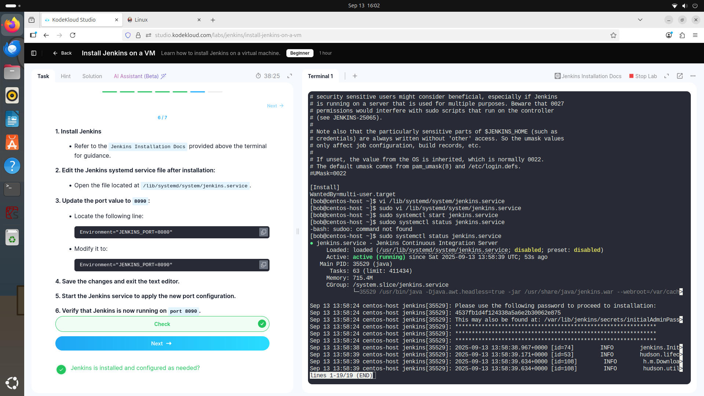
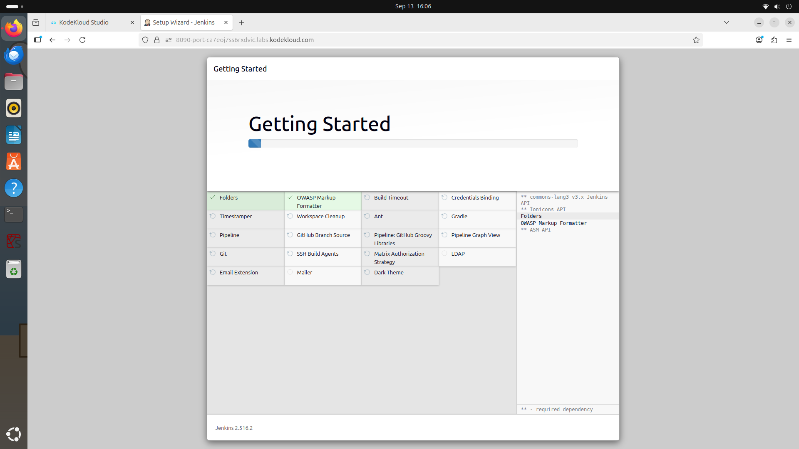

---

## 3️ Jenkins CLI for Automation & Management

- Configured **SSH keys** for user `mike`.  
- Added the SSH key to Jenkins.  
- Performed a safe restart with the built-in command:

```bash
safe-restart
```
## Evidence:

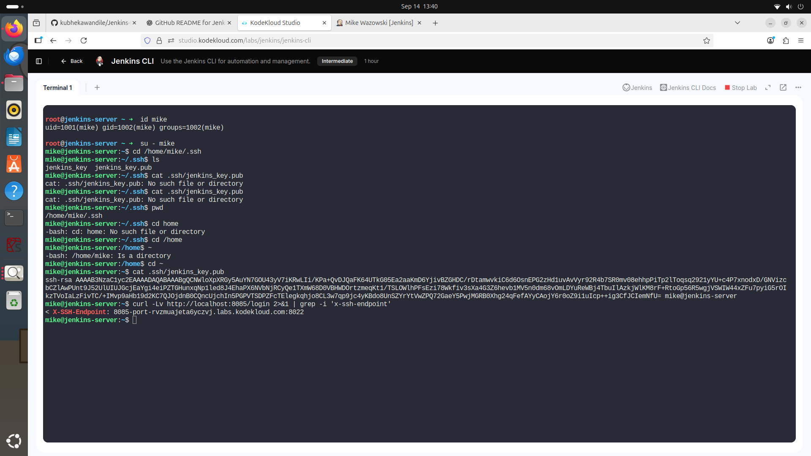
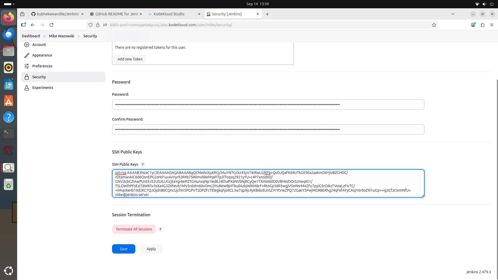
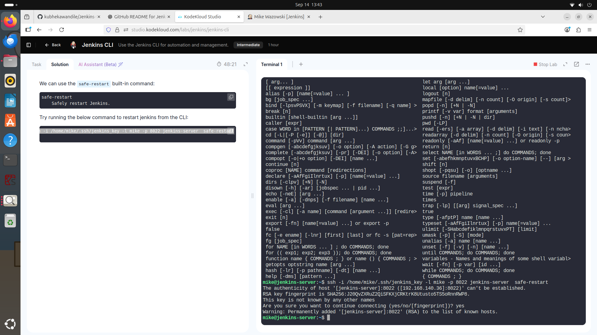

---

## 4️ ThinBackup Plugin – Backup & Restore

- Installed the ThinBackup plugin.
- Backed up all Jenkins configurations and successfully restored them.

## Evidence:
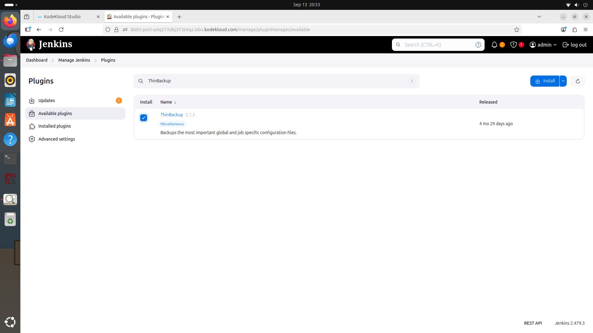

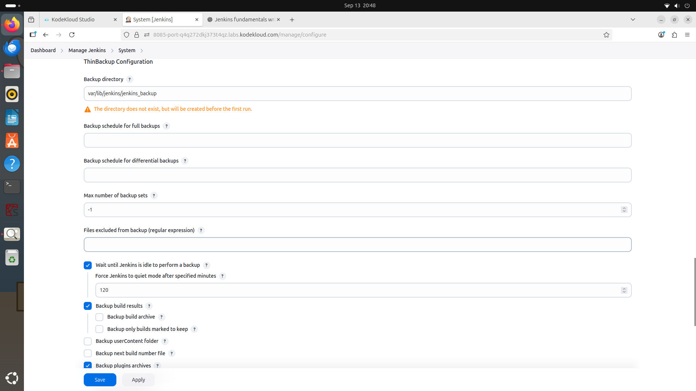
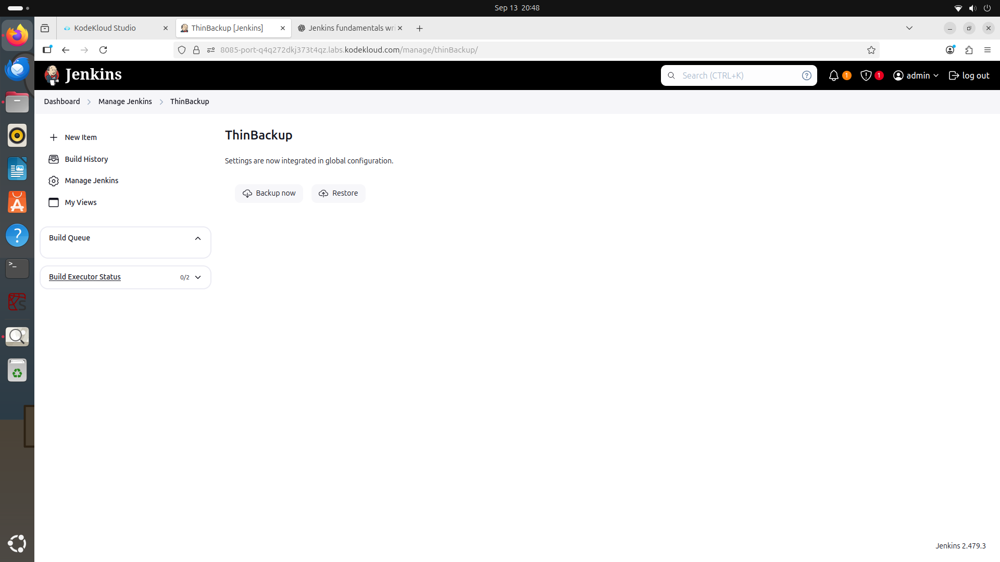

---

## 5️ Continuous Delivery (CD) Pipeline

Built and configured a CD pipeline to automate build, test, and deployment.

## Evidence:
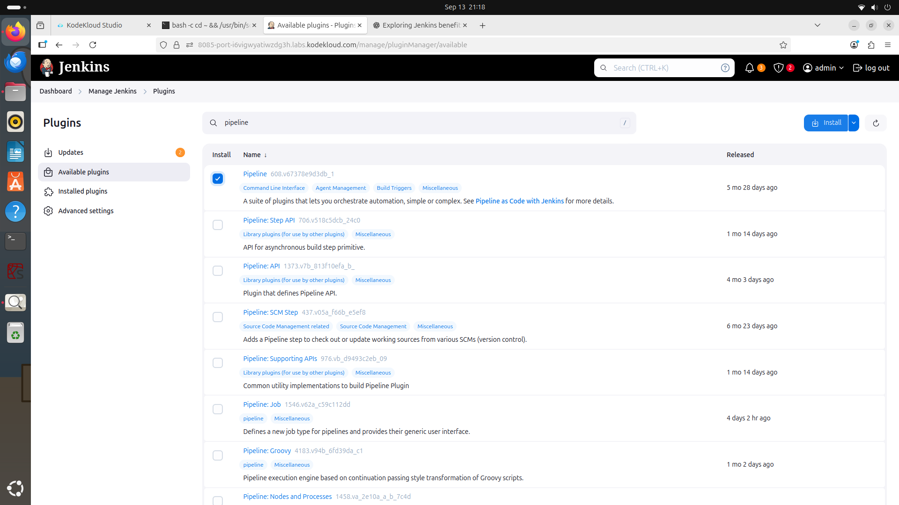
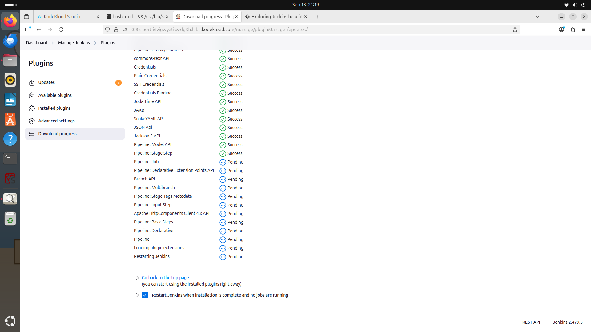
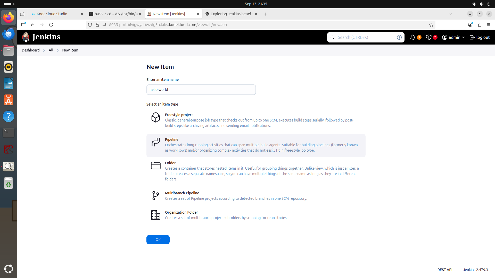
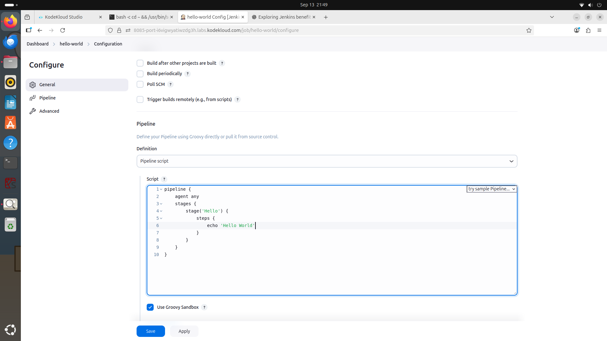
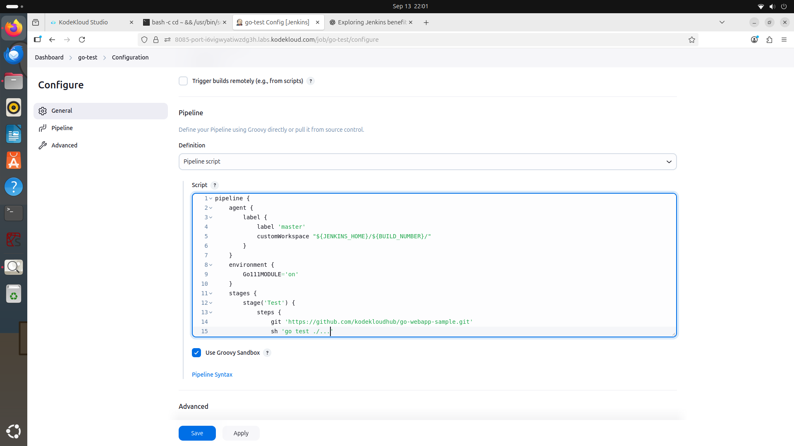


# GRC Key Takeaways

From a Governance, Risk & Compliance perspective, the following controls are essential for a Jenkins environment:

- **Access Controls** – Regularly review user accounts, roles, and permissions.  
- **Plugin Management** – Patch plugins promptly, use only trusted sources, and monitor for known vulnerabilities.  
- **Backup & Recovery** – Schedule and test backups to ensure quick disaster recovery.  
- **Pipeline Configuration & Code Review** – Enforce proper configuration of pipeline scripts and peer reviews to prevent insecure code.  
- **Integration with SIEM** – Forward logs to a Security Information & Event Management system to detect and alert on malicious activity.  
- **Credential Management** – Periodically review and rotate stored secrets/credentials to minimize risk.  
- **System Hardening** – Restrict who can install plugins or change system settings to reduce the attack surface.

# Lessons Learned
 
- Working through the Jenkins Foundations labs showed me that mastering the tool is only half the story—understanding its security and governance requirements is just as critical.
- I learned how routine tasks like installing plugins, configuring pipelines, and managing credentials directly affect an organization’s risk posture.
- Regular access-control reviews, disciplined plugin patching, reliable backup and recovery procedures, and secure pipeline configuration all help maintain compliance and reduce vulnerabilities.
- I also recognized the value of integrating Jenkins with monitoring and SIEM tools to detect suspicious activity early.
- Lessons Learned
Working through the Jenkins Foundations labs showed me that mastering the tool is only half the story—understanding its security and governance requirements is just as critical. I learned how routine tasks like installing plugins, configuring pipelines, and managing credentials directly affect an organization’s risk posture. Regular access-control reviews, disciplined plugin patching, reliable backup and recovery procedures, and secure pipeline configuration all help maintain compliance and reduce vulnerabilities. I also recognized the value of integrating Jenkins with monitoring and SIEM tools to detect suspicious activity early. This project reinforced that technical skills and a strong GRC mindset must work hand-in-hand to build resilient, audit-ready automation environments.This project reinforced that technical skills and a strong GRC mindset must work hand-in-hand to build resilient, audit-ready automation environments. 

